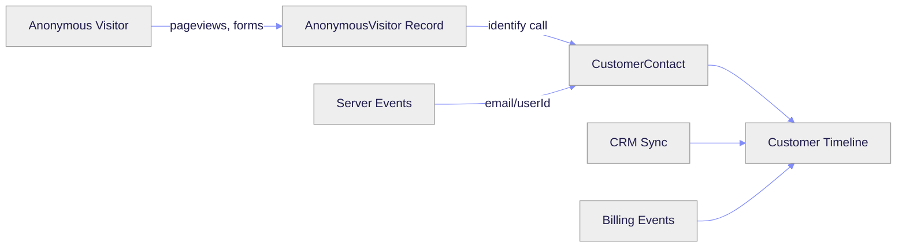

## The Customer Journey Problem

Most businesses track customer data in silos:
- **Website analytics** shows anonymous pageviews
- **Product analytics** shows authenticated user behavior
- **CRM** shows deals and conversations
- **Billing** shows payment events

Outlit connects all of these into a unified customer timeline.

## How Outlit Tracking Works



### Browser Tracking (Anonymous Phase)

When a visitor lands on your website, Outlit:

1. **Generates a visitor ID** - A unique identifier stored in localStorage and cookies
2. **Captures automatically**:
   - Pageviews (URL, title, referrer)
   - Form submissions (with sensitive field sanitization)
   - UTM parameters and first-touch attribution
3. **Stores events** in the `AnonymousVisitor` record until identification

### Identity Resolution

When a visitor identifies themselves (signup, login, form submission with email), Outlit:

1. **Creates or finds a CustomerContact** using the email or user ID
2. **Links the anonymous visitor** to the contact
3. **Converts historical events** to the customer timeline
4. **Merges profiles** if the same person used different devices

### Server-Side Tracking

For authenticated users in your backend:

1. **Skip the anonymous phase** - Users are already known
2. **Emit events directly** to the CustomerContact
3. **Require identity** - Email or user ID on every call

## Data Model

<AccordionGroup>
  <Accordion title="AnonymousVisitor" icon="user-secret">
    Represents an unknown website visitor before identification.
    
    | Field | Description |
    |-------|-------------|
    | `visitorId` | Browser-generated UUID (stored in localStorage) |
    | `firstTouchUtm` | UTM parameters from first visit |
    | `firstLandingUrl` | First page they visited |
    | `firstReferrer` | Where they came from |
    | `ipAddress` | For company enrichment |
    | `resolvedToContactId` | Link to CustomerContact after identification |
  </Accordion>
  
  <Accordion title="CustomerContact" icon="user">
    A known person associated with a customer account.
    
    | Field | Description |
    |-------|-------------|
    | `email` | Primary identifier (required) |
    | `customerId` | Link to the Customer/Account |
    | `name`, `phone`, `jobTitle` | Profile information |
    | `role`, `influence` | Your classification |
  </Accordion>
  
  <Accordion title="Customer" icon="building">
    A company or individual account in your system.
    
    | Field | Description |
    |-------|-------------|
    | `name` | Company or individual name |
    | `domain` | Primary domain for resolution |
    | `type` | `COMPANY` or `INDIVIDUAL` |
    | `status` | `ACTIVE`, `PROVISIONAL`, `MERGED` |
  </Accordion>
  
  <Accordion title="CustomerActivity" icon="bolt">
    A single event in the customer timeline.
    
    | Field | Description |
    |-------|-------------|
    | `activityType` | What happened (e.g., `FEATURE_USED`, `PAGE_VIEW`) |
    | `activityChannel` | Category (`PRODUCT`, `COMMUNICATION`, `BILLING`) |
    | `occurredAt` | When it happened |
    | `title`, `summary` | Human-readable description |
    | `metadata` | Event-specific data |
  </Accordion>
</AccordionGroup>

## Event Types

### Automatic Events

These are captured automatically by the browser tracker:

| Event | When | Data Captured |
|-------|------|---------------|
| `pageview` | Every navigation | URL, path, title, referrer, UTM |
| `form` | Form submission | Form ID, field values (sanitized) |

### Manual Events

Track custom events that matter to your business:

```typescript
// Track a custom event
outlit.track('pricing_page_viewed', {
  plan: 'pro',
  source: 'header_nav'
})

// Identify a visitor
outlit.identify({
  email: 'user@example.com',
  traits: {
    name: 'Jane Doe',
    company: 'Acme Inc'
  }
})
```

## Privacy & Security

<CardGroup cols={2}>
  <Card title="Form Sanitization" icon="shield">
    Sensitive fields (password, SSN, credit card) are automatically stripped from form submissions.
  </Card>
  <Card title="Domain Allowlist" icon="lock">
    Configure which domains can send events to prevent unauthorized tracking.
  </Card>
  <Card title="No PII in URLs" icon="eye-slash">
    Query parameters with sensitive patterns are automatically redacted.
  </Card>
  <Card title="GDPR Ready" icon="scale-balanced">
    Built-in support for data deletion and export requests.
  </Card>
</CardGroup>

## Next Steps

<Columns cols={2}>
  <Card title="Quick Start" icon="rocket" href="/tracking/quickstart">
    Set up tracking in 5 minutes
  </Card>
  <Card title="Browser Tracking" icon="browser" href="/tracking/browser/script">
    Learn about browser integration options
  </Card>
  <Card title="Server-Side" icon="server" href="/tracking/server/nodejs">
    Track events from your backend
  </Card>
  <Card title="Identity" icon="fingerprint" href="/tracking/identity/overview">
    Understand identity resolution
  </Card>
</Columns>

